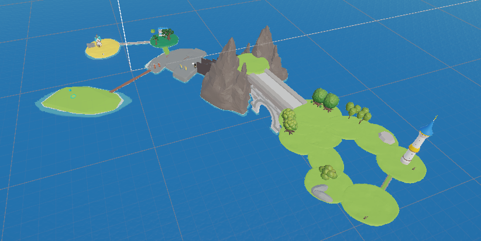
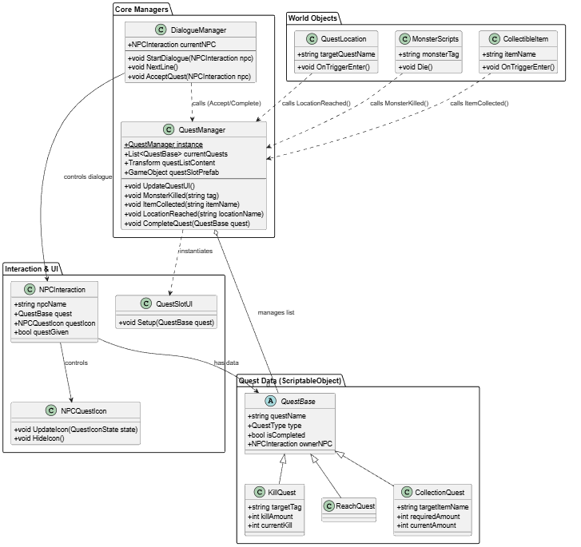
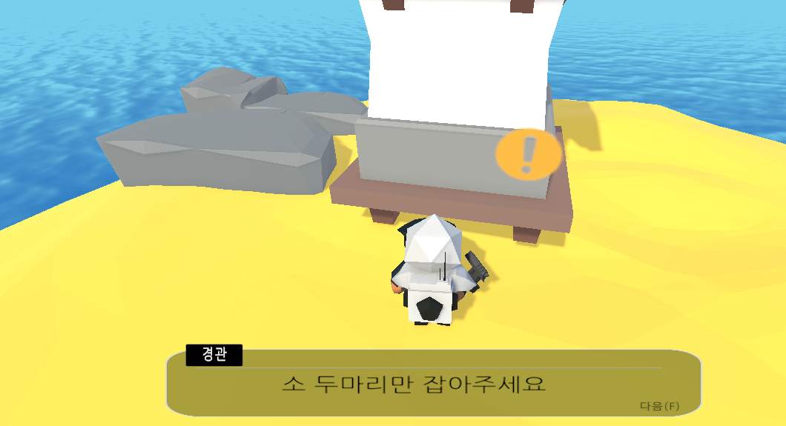
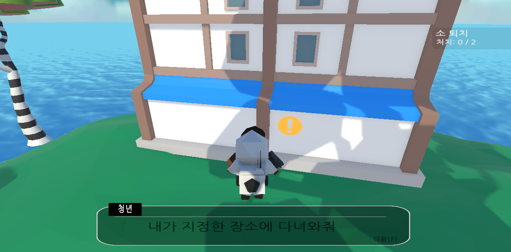
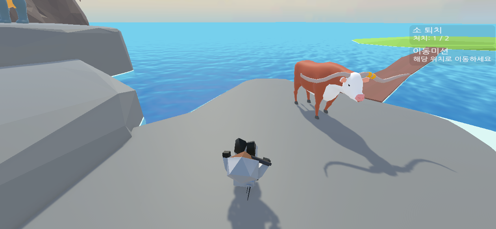
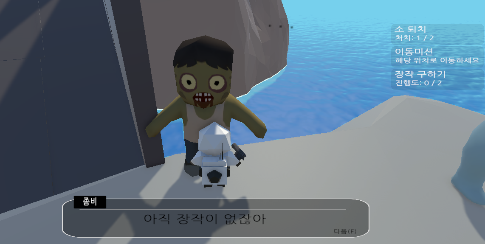
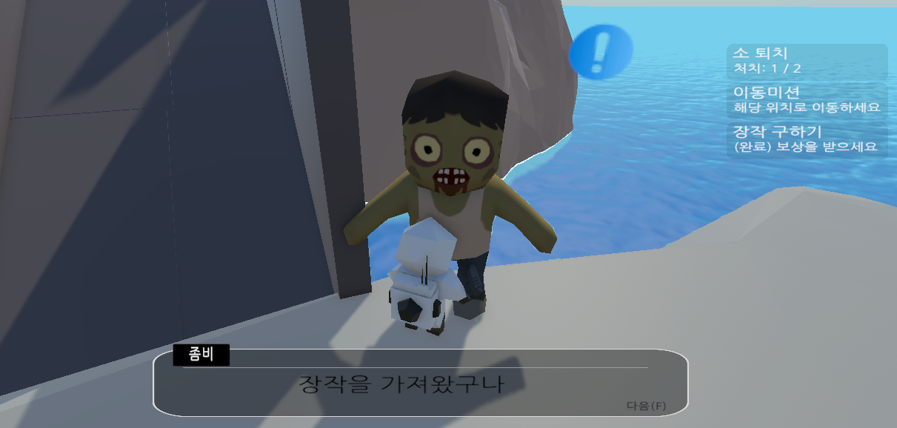

# 🗺️ Unity Quest & Dialogue System

> **ScriptableObject를 활용한 확장 가능한 퀘스트 시스템 구현** > 다양한 타입의 퀘스트(사냥, 수집, 이동)를 유연하게 생성하고 관리할 수 있는 모듈형 RPG 퀘스트 시스템입니다.

<br>

## 📸 Project Overview

<div align="center">
  
  <p><em>▲ 다양한 NPC와 상호작용하며 퀘스트를 수행하는 오픈월드 맵 전경</em></p>
</div>

<br>

## 🛠 Tech Stack

| Category | Technology |
| :--- | :--- |
| **Engine** | Unity 2022.x (3D) |
| **Language** | C# |
| **Pattern** | Manager Pattern, Singleton |
| **Data** | ScriptableObject (Data-Driven) |
| **UI** | TextMeshPro (TMP) |

<br>

## 🧩 System Architecture (UML)

본 프로젝트는 **데이터(Data)와 로직(Logic)의 분리**를 핵심 설계 철학으로 삼아, 유지보수성과 확장성을 확보했습니다.

<div align="center">
  
</div>

### 🏗️ Design Highlights
* **ScriptableObject 기반 데이터 설계:** `QuestBase`를 상속받아 `Kill`, `Collect`, `Reach` 등 새로운 퀘스트 타입을 코드 수정 없이 확장할 수 있도록 구현했습니다.
* **중앙 집중식 관리 (Core Managers):**
    * `QuestManager`: 모든 퀘스트의 진행 상태(Progress) 및 완료 이벤트를 중앙에서 관리합니다.
    * `DialogueManager`: NPC와의 대화 흐름을 제어하고, 퀘스트 수락/완료 시점과 연동됩니다.
* **느슨한 결합 (Loose Coupling):** 몬스터(`MonsterScripts`)나 아이템(`CollectibleItem`)은 퀘스트 로직을 직접 참조하지 않고, 이벤트 발생 시 매니저에게 알림만 보내는 구조로 의존성을 최소화했습니다.

<br>

## ✨ Key Features & Implementation

### 1. NPC 상호작용 및 퀘스트 수락 (Interaction)
플레이어가 NPC에게 접근하여 대화를 나누고 퀘스트를 수락하는 과정입니다. `DialogueManager`가 NPC의 퀘스트 보유 여부와 진행 상태를 판단하여 적절한 대사를 출력합니다.

<div align="center">
  
  
</div>

<br>

### 2. 다양한 미션 수행 (Gameplay Loop)
`QuestManager`가 실시간으로 게임 내 이벤트를 감지하여 목표 달성 여부를 체크합니다. 우측 상단 퀘스트 UI 패널에 진행도가 실시간으로 업데이트됩니다.

* **Kill Quest:** 특정 태그를 가진 몬스터 처치
* **Reach Quest:** 지정된 위치(Collider) 도달
* **Collect Quest:** 특정 아이템 수집

<div align="center">
  
</div>

<br>

### 3. 퀘스트 완료 및 보상 (Completion)
목표를 달성한 후 NPC에게 돌아오면, 완료 대사가 출력되며 퀘스트가 종료됩니다. `isCompleted` 플래그가 활성화되어 중복 수행을 방지합니다.

<div align="center">
  
  
</div>

<br>

## 💻 Core Implementation Code

### 1. 확장 가능한 퀘스트 데이터 (QuestBase.cs)
```csharp
public enum QuestType { Kill, Reach, Collect }

// ScriptableObject를 상속받아 데이터 에셋으로 관리 (Inspector 수정 가능)
public class QuestBase : ScriptableObject
{
    public string questName;        // 퀘스트 제목
    public QuestType type;          // 퀘스트 타입
    public bool isCompleted;        // 완료 여부 저장
    public NPCInteraction ownerNPC; // 퀘스트 발주자
}

// 몬스터 처치 시 호출되는 이벤트 함수
public void MonsterKilled(string tag)
{
    foreach (var quest in currentQuests)
    {
        // 타입이 Kill이고, 태그가 일치하며, 미완료 상태인 경우만 처리
        if (quest.type == QuestType.Kill && !quest.isCompleted)
        {
            KillQuest killQ = (KillQuest)quest;
            
            if (killQ.targetTag == tag)
            {
                killQ.currentKill++;
                UpdateQuestUI(); // UI 실시간 갱신

                // 목표 달성 시 NPC 아이콘 변경 (완료 가능 상태 알림)
                if (killQ.currentKill >= killQ.killAmount)
                {
                    if (quest.ownerNPC != null)
                        quest.ownerNPC.questIcon.UpdateIcon(QuestIconState.Complete);
                }
            }
        }
    }
}

```
---
Developer: 황준현

Contact: h010617@naver.com
